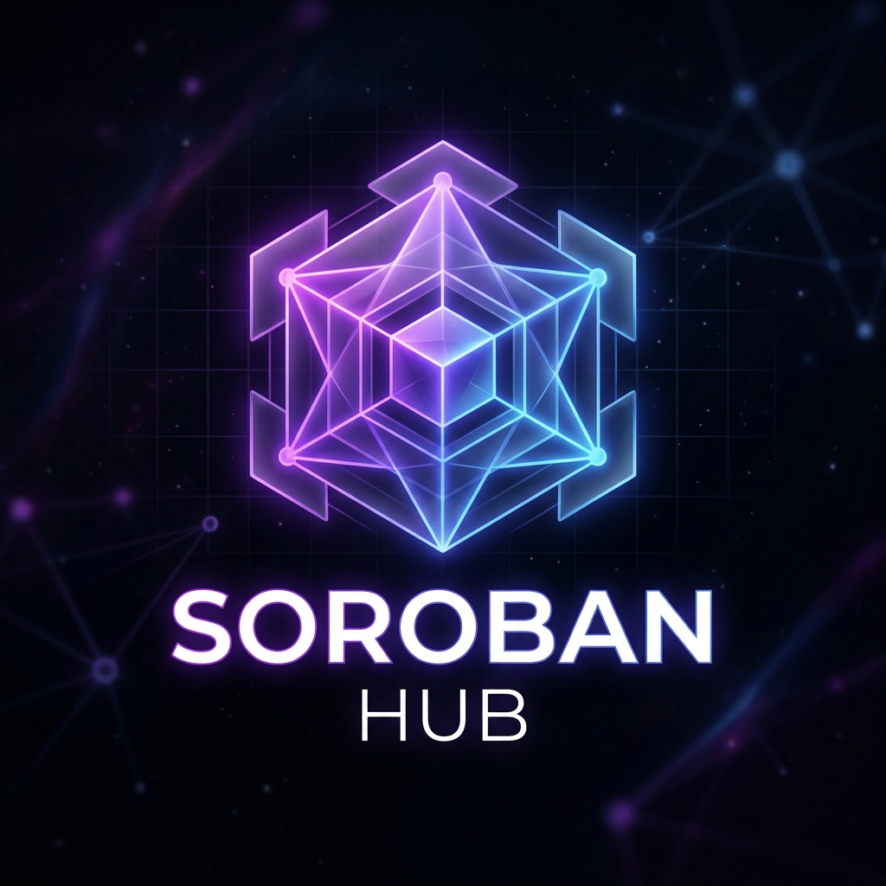
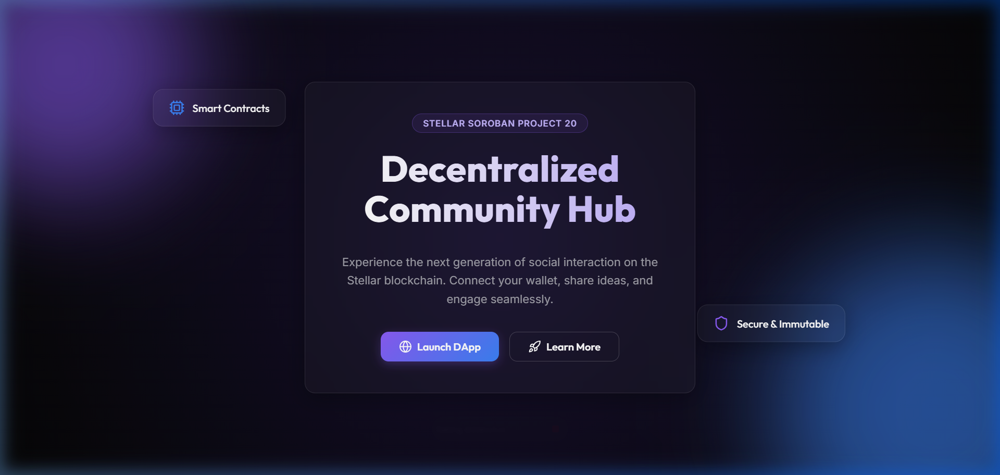
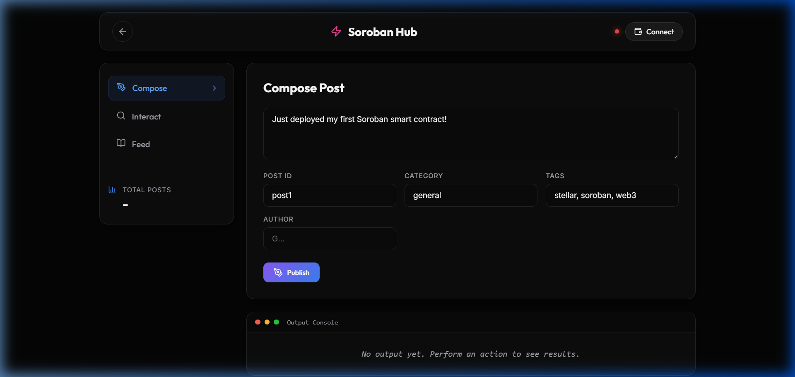
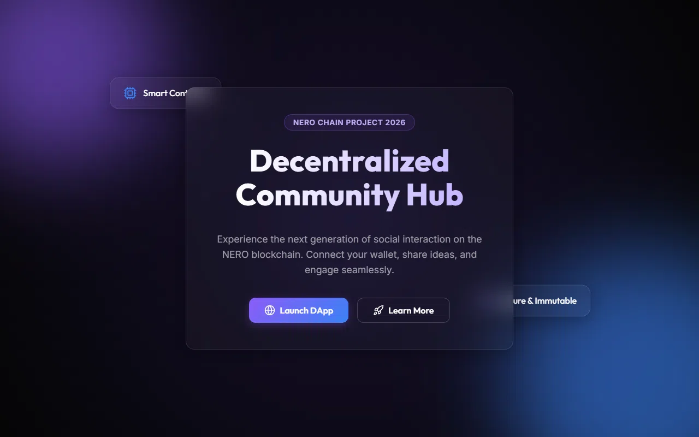
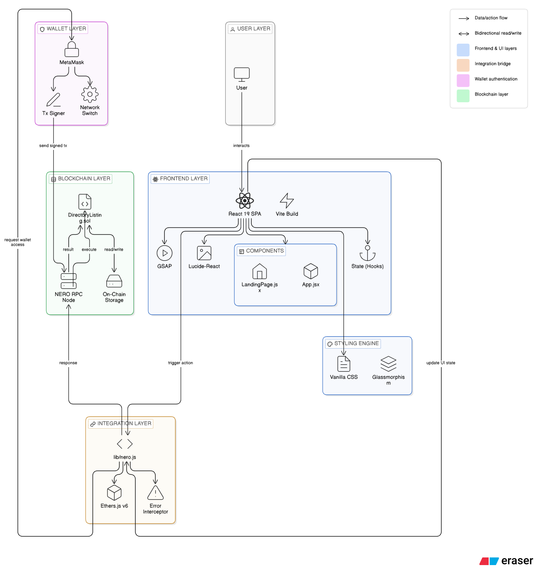

<p align="center">
  
</p>

# NERO Hub: Decentralized Community Platform

A fully decentralized community engagement application built on the **NERO blockchain** using EVM smart contracts. This platform features a breathtaking **Web3 Glassmorphism** aesthetic, high-performance interactions, and seamless wallet connectivity via **MetaMask**.

## 🎥 Preview & Demo

**Dynamic Landing Page**  


**Interactive Dashboard**  


**Video Walkthrough**  


---

## 🌟 System Architecture (End-To-End)



This application is built with a decoupled architecture connecting a premium, state-of-the-art React frontend to a secure NERO EVM backend.

### 1. The Frontend Layer (React + Vite)
- **Vite & React 19:** Serves as the foundation. Vite provides ultra-fast Hot Module Replacement (HMR) and a highly optimized production build. React handles the component structure.
- **Conditional SPA Routing:** For performance and simplicity, the application bypasses heavy routing libraries in favor of direct React state rendering. This provides instantaneous transitions between the landing page and the core application.
- **GSAP (GreenSock):** The `LandingPage.jsx` leverages GSAP's timeline (`gsap.timeline`) mechanics for complex 3D-feeling micro-animations and text-reveal mechanics.
- **Lucide-React Iconography:** Replaces default browser emojis with high-fidelity, scalable SVG vectors.

### 2. Styling System & Glassmorphism
- **Vanilla CSS Engine:** Uses raw CSS with extensive CSS variables mapped across `index.css` and `App.css`, allowing for globally consistent theming. 
- **Glassmorphism Metrics:** Defines elements with `.glass` classes, utilizing `backdrop-filter: blur(16px)` stacked over semi-transparent backgrounds.

### 3. Blockchain Integration Bridge (`lib/nero.js`)
- **MetaMask API:** Interacts with the browser's `window.ethereum` object to handle user connections and automatically switch to/add the NERO Testnet.
- **Ethers.js (v6):** Handles direct RPC interfacing to submit and parse EVM transactions and smart contract calls.
- **Error Interception Layer:** Translates blockchain reverts and JSON-RPC errors into elegant, non-crashing UI alerts.

---

## 🛠 Features

- **Create Post:** Mint a new post onto the NERO blockchain. Supports metadata such as Category, Tags, Author, and custom IDs.
- **Interact:** Comment or like any arbitrary post securely via MetaMask. 
- **Moderation:** Directly flag malicious posts or trigger remove-post mutations directly from the contract.
- **Live Feed Tracking:** Data polling for post feeds and individual post inspections.

---

## 🚀 Setup & Installation Guide

Follow these sequential steps precisely to run the platform locally or extend its development.

### Pre-requisites
1. **Node.js** (v18 or higher)
2. **NPM** (v9 or higher)
3. **MetaMask Wallet Extension** installed in your browser.
4. **Testnet NERO Tokens**: Obtain NERO testnet tokens from the official faucet if you plan to deploy or interact with contracts.

### Part 1: Smart Contract Setup & Deployment

The smart contracts are built and deployed using **Hardhat**.

1. Navigate to the EVM contracts directory:
   ```bash
   cd evm-contracts
   ```
2. Install Hardhat dependencies:
   ```bash
   npm install
   ```
3. Create a `.env` file in the `evm-contracts` directory and add your MetaMask private key (used for deployment):
   ```env
   PRIVATE_KEY=your_metamask_wallet_private_key_here
   ```
4. Compile the smart contracts:
   ```bash
   npx hardhat compile
   ```
5. Deploy to the NERO Testnet:
   ```bash
   npx hardhat run scripts/deploy.js --network neroTestnet
   ```
   *Note the deployed contract address output in your terminal.*

### Part 2: Frontend Setup

1. Navigate to the frontend application directory:
   ```bash
   cd ../ # Back to my-nero-app/ (if you were in evm-contracts)
   npm install 
   ```
2. **Update the Contract Address:**
   Open `lib/nero.js` and update the `CONTRACT_ADDRESS` constant at the top of the file with the address you got from Part 1:
   ```javascript
   export const CONTRACT_ADDRESS = "0xYourDeployedContractAddressHere"; 
   ```

### Part 3: Running Locally (Development Mode)

To spin up the Vite development server (usually available on `localhost:5173`):
```bash
npm run dev
```

### Part 4: Connecting MetaMask to NERO
The frontend application handles adding the NERO Testnet automatically, but for manual reference, the network details are:
- **Network Name:** NERO Testnet
- **RPC URL:** `https://rpc-testnet.nerochain.io`
- **Chain ID:** `689`
- **Currency Symbol:** `NERO`

---

## 📂 Project Structure Walkthrough

```text
my-nero-app/
├── evm-contracts/      # Hardhat project for Smart Contracts
│   ├── contracts/      # Solidity contracts (CommunityPlatform.sol)
│   ├── scripts/        # Deployment scripts (deploy.js)
│   └── hardhat.config.js # Network configurations for NERO
├── public/             # Static, uncompiled web assets
├── src/
│   ├── components/
│   │   ├── LandingPage.jsx # Hero introduction component + GSAP timelines
│   │   └── CommunityApp.jsx# Core Application, Navigation Tabs, and Integration logic
│   ├── App.jsx         # Root layout and conditional rendering orchestrator
│   ├── index.css       # Boilerplate resets & Typography imports
│   └── main.jsx        # React root DOM injector
├── lib/
│   └── nero.js         # The ethers.js bridge to the deployed EVM contracts
└── vite.config.js      # Build tooling parameters
```

---

<p align="center">
  <b>If you liked the project, don't forget to give it a ⭐</b>
</p>
